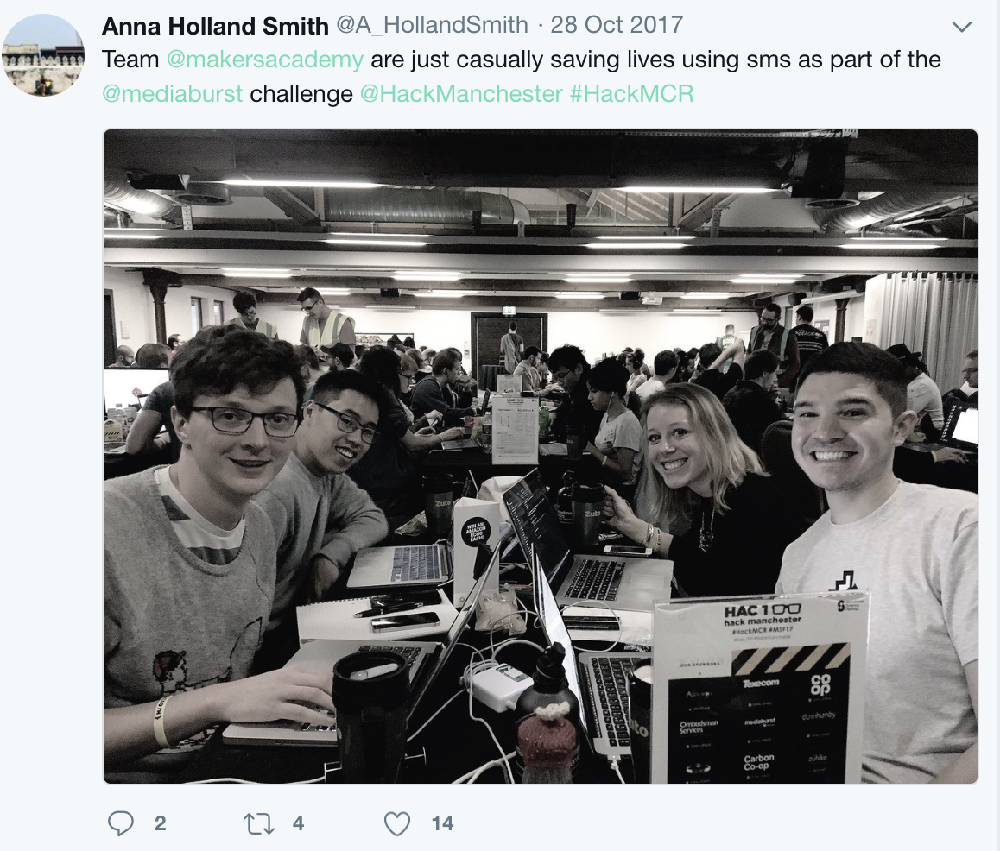
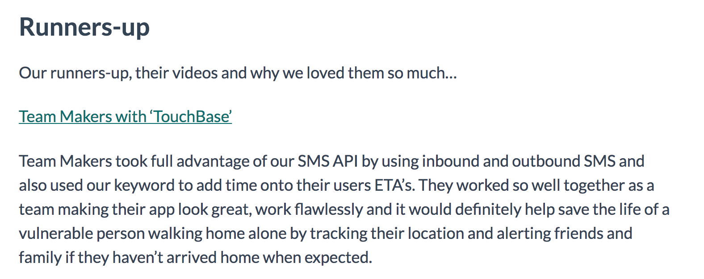

# touchbase app

Touchbase was our entry to [Hack Manchester](https://www.hac100.com/).

Here's a lovely picture of us all at the start, before the sleep deprivation and the over-caffeination.

The hackathon also required that all entries had a short video introduction to the team and the product. You can take a look at our over on [youtube](https://youtu.be/DqdluFS_gZY).
_The strange surroundings we are filming in are actually those of the Manchester_ [Museum of Science and Industry](https://www.msimanchester.org.uk/)

### We didn't win (but we were runner's up!)

_And here's what the judges thought of our entry:_

## setup
- `npm i -g exp` to install expo cli globally
- `brew install watchman` to install watchman
- download the expo app on your device,
- `npm i` to install project dependencies
- `exp start` to start the app and get a QR code
- scan the QR code to load the app in dev mode with hot reloading and all the cool expo things beep boop
